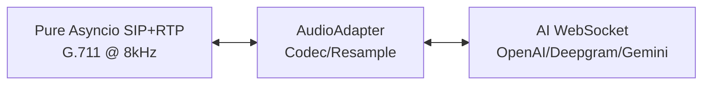
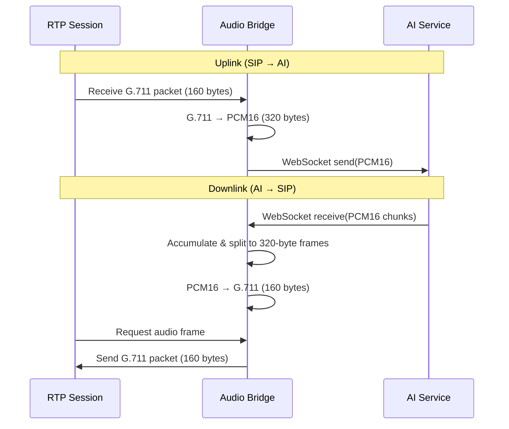

# SIP-to-AI

¿Por qué existe este proyecto?

La mayoría de los marcos de trabajo de agentes de voz:
- requieren WebRTC
- dependen de librerías pesadas (C / ffmpeg)
- no son nativos de telefonía

Este proyecto:
- SIP + RTP en Python puro (sin dependencias en C)
- puente directo a IA en tiempo real
- diseñado para escenarios de centros de llamadas / telefonía

**SIP-to-AI** — transmite audio RTP desde **FreeSWITCH / OpenSIPS / Asterisk** directamente a **modelos de voz en tiempo real de extremo a extremo**:
- ✅ **OpenAI Realtime API** (`gpt-realtime-2`)
- ✅ **Deepgram Voice Agent**
- ✅ **Gemini Live** (`gemini-3.1-flash-live-preview`, Gemini 2.5 Flash)
- ✅ **xAI Grok Voice** (grok-voice-think-fast-1.0)

Puente de paso simple: **SIP (G.711 μ-law @ 8kHz)** ↔ **modelos de voz de IA**. OpenAI, Deepgram y Grok son compatibles con G.711 nativo; Gemini requiere remuestreo PCM16 (8kHz ↔ 16kHz/24kHz).

## Inicio Rápido (OpenAI Realtime)

**Prerrequisitos:** Python 3.12+, gestor de paquetes UV

**Python puro, sin dependencias externas:** Este proyecto utiliza una implementación de SIP+RTP en asyncio con Python puro. ¡No se requieren bibliotecas en C ni compilación!

1. **Instalar dependencias:**
   ```bash
   git clone <repository-url>
   cd sip-to-ai
   uv venv && source .venv/bin/activate
   uv sync
   ```

2. **Configurar el entorno:**
   ```bash
   cp .env.example .env
   ```

   Edita `.env` con tu clave API de OpenAI:
   ```bash
   # AI Service
   AI_VENDOR=openai
   OPENAI_API_KEY=sk-proj-your-key-here
   OPENAI_PROJECT=proj-your-project-id-here
   OPENAI_MODEL=gpt-realtime-2

   # Agent prompt
   AGENT_PROMPT_FILE=agent_prompt.yaml

   # SIP Settings (userless account - receive only)
   SIP_DOMAIN=192.168.1.100
   SIP_TRANSPORT_TYPE=udp
   SIP_PORT=6060
   ```

   **Opcional:** Crea `agent_prompt.yaml` para una personalidad personalizada del agente:
   ```yaml
   instructions: |
     You are a helpful AI assistant. Be concise and friendly.

   greeting: "Hello! How can I help you today?"
   ```

3. **Ejecutar el servidor:**
   ```bash
   uv run python -m app.main
   ```

   El servidor escuchará en `SIP_DOMAIN:SIP_PORT` las llamadas entrantes. Cada llamada crea una conexión WebSocket de OpenAI Realtime independiente.

4. **Realizar una llamada de prueba:**
   ```bash
   # From FreeSWITCH/Asterisk, dial to bridge IP:port
   # Or use a SIP softphone to call sip:192.168.1.100:6060
   ```

## Vista General del Proyecto

### Arquitectura Central



**Filosofía de diseño:** Lógica mínima en el cliente. El puente es una tubería de audio transparente:
- **asyncio en Python puro**: Sin problemas de GIL, sin dependencias en C
- **Solo conversión de codec**: PCM16 ↔ G.711 μ-law (OpenAI/Deepgram: mismo 8kHz, sin remuestreo; Gemini: remuestreo 8kHz ↔ 16kHz/24kHz)
- **Sincronización precisa de 20 ms**: Uso de `asyncio.sleep()` con corrección de deriva
- **Concurrencia estructurada**: Todas las tareas gestionadas con `asyncio.TaskGroup`
- **Sin VAD/interjección en el cliente**: Los modelos de IA manejan toda la detección de actividad de voz
- **Sin buffer de jitter**: Los servicios de IA proporcionan audio prebufferizado
- **Gestión de conexión**: Ciclo de vida y reconexión de WebSocket

### Flujo de Audio



**Puntos clave:**
- **Marcos de 20 ms**: 320 bytes PCM16 (8kHz) o 160 bytes G.711 μ-law
- **Basado en asyncio**: Protocolo RTP → asyncio.Queue → WebSocket de IA asíncrono
- **Fragmentos de IA variables**: Se acumulan en un búfer y se dividen en marcos fijos de 320 bytes
- **Sin relleno durante la transmisión**: Los marcos incompletos se mantienen hasta que llegue el siguiente fragmento

### Componentes

#### Pila SIP+RTP (`app/sip_async/`)

**`AsyncSIPServer`** (`app/sip_async/async_sip_server.py`)
- Servidor SIP en asyncio puro que escucha solicitudes INVITE
- Protocolo de datagramas UDP para señalización SIP
- Crea instancias AsyncCall para cada llamada entrante
- Maneja mensajes SIP: INVITE, ACK, BYE con respuestas correctas según RFC 3261

**`RTPSession`** (`app/sip_async/rtp_session.py`)
- Implementación del protocolo RTP en asyncio puro
- Soporte para codec G.711 μ-law (PCMU)
- Sincronización precisa de marcos de 20 ms con corrección de deriva
- Transmisión de audio bidireccional sobre UDP

**`RTPAudioBridge`** (`app/sip_async/audio_bridge.py`)
- Conecta la sesión RTP con AudioAdapter
- Maneja la conversión de codec G.711 ↔ PCM16
- Utiliza asyncio.TaskGroup para concurrencia estructurada

#### Capa de Puente (`app/bridge/`)

**`AudioAdapter`** (`app/bridge/audio_adapter.py`)
- Adaptador de formato de audio para transmisión SIP ↔ IA
- Paso directo de PCM16 con conversión de codec opcional
- Búfer de acumulación para fragmentos de IA de tamaño variable → marcos fijos de 320 bytes
- Búferes seguros para hilos: `asyncio.Queue` para enlace ascendente y descendente

**`CallSession`** (`app/bridge/call_session.py`)
- Gestiona el ciclo de vida de la conexión con IA para una sola llamada
- Tres tareas asíncronas por llamada:
  1. **Enlace ascendente**: Leer desde AudioAdapter → enviar a IA
  2. **Recepción de IA**: Recibir fragmentos de IA → alimentar a AudioAdapter
  3. **Salud**: Ping a la conexión de IA, reconexión en caso de fallo
- Utiliza `asyncio.TaskGroup` para concurrencia estructurada

#### Clientes de IA (`app/ai/`)

**`OpenAIRealtimeClient`** (`app/ai/openai_realtime.py`)
- WebSocket: `wss://api.openai.com/v1/realtime`
- Formato de audio: `audio/pcmu` (G.711 μ-law @ 8kHz)
- Compatible con configuración de sesión: instrucciones, voz, temperatura
- Mensaje de saludo opcional al conectar

**`DeepgramAgentClient`** (`app/ai/deepgram_agent.py`)
- WebSocket: `wss://agent.deepgram.com/agent`
- Formato de audio: mulaw (igual que G.711 μ-law @ 8kHz)
- Configuraciones: modelo de escucha, modelo de habla, modelo LLM, prompt del agente

**`GeminiLiveClient`** (`app/ai/gemini_live.py`)
- WebSocket: `wss://generativelanguage.googleapis.com/ws/...BidiGenerateContent`
- Formato de audio: PCM16 (entrada @ 16kHz, salida @ 24kHz)
- Remuestreo: 8kHz SIP ↔ 16kHz/24kHz Gemini (manejado internamente)
- El enlace ascendente utiliza el Blob `realtimeInput.audio` (el campo obsoleto `mediaChunks` es rechazado por modelos más recientes como `gemini-3.1-flash-live-preview` con cierre de WebSocket 1007)
- Configuraciones: modelo, voz, instrucciones del sistema

**`GrokVoiceClient`** (`app/ai/grok_voice.py`)
- WebSocket: `wss://api.x.ai/v1/realtime`
- Formato de audio: `audio/pcmu` (G.711 μ-law @ 8kHz, sin remuestreo)
- Establecimiento de conexión (handshake): emite `conversation.created` como señal de conexión lista (no `session.created`)
- Configuraciones: modelo, voz, instrucciones; saludo mediante `response.create` con `metadata.client_event_id` requerido

## Configuración del Agente de Voz de Deepgram

Establece `AI_VENDOR=deepgram` en `.env`:

```bash
AI_VENDOR=deepgram
DEEPGRAM_API_KEY=your-key-here
AGENT_PROMPT_FILE=agent_prompt.yaml  
DEEPGRAM_LISTEN_MODEL=nova-2
DEEPGRAM_SPEAK_MODEL=aura-asteria-en
DEEPGRAM_LLM_MODEL=gpt-4o-mini
```

Crea `agent_prompt.yaml` (requerido):
```yaml
instructions: |
  You are a helpful AI assistant. Be concise and friendly.

greeting: "Hello! How can I help you today?"
```

Obtén tu clave API en [Deepgram Console](https://console.deepgram.com).

### Usar una voz de 60db con el cerebro de Deepgram (`SPEAK_PROVIDER=60db`)

60db **no** es un agente de voz de extremo a extremo: no tiene un LLM, solo entrada/salida de voz (STT, TTS, voces).
Por lo tanto, no puede reemplazar a Deepgram. En cambio, puede utilizarse como la **voz** del agente de Deepgram:
Deepgram sigue realizando STT + LLM (`gpt-4o-mini`) + VAD/gestión de turnos y emite la respuesta del agente
como texto (`ConversationText`); sintetizamos ese texto con **TTS de 60db** (μ-law @ 8kHz) y alimentamos
de nuevo al llamante. Deepgram es el cerebro, 60db es la boca.

```bash
AI_VENDOR=deepgram
DEEPGRAM_API_KEY=your-deepgram-key
DEEPGRAM_LISTEN_MODEL=nova-2
DEEPGRAM_LLM_MODEL=gpt-4o-mini
AGENT_PROMPT_FILE=agent_prompt.yaml

# Switch the voice to 60db
SPEAK_PROVIDER=60db
SIXTYDB_API_KEY=sk_live_your_60db_key
SIXTYDB_VOICE_ID=fbb75ed2-975a-40c7-9e06-38e30524a9a1
```

Lista las voces en tu cuenta de 60db para elegir un `SIXTYDB_VOICE_ID`:

```bash
uv run python scripts/list_60db_voices.py
```

**Cómo funciona:** El `60db TTS WebSocket` (`wss://api.60db.ai/ws/tts`) está configurado para
`MULAW` @ 8kHz, por lo que su audio se inserta directamente en el puente existente sin remuestreo.
`DEEPGRAM_SPEAK_MODEL` se ignora en este modo (el audio propio de Deepgram se descarta).

**Compromisos:** enrutar el texto de respuesta a un segundo servicio añade algo de latencia, y se pierde
el timing nativo de interjección (barge-in) de Deepgram en el audio hablado (este modo es efectivamente semidúplex,
coincidiendo con la supresión de interjección existente de Deepgram). Úsalo solo cuando desees específicamente una
voz/clon de 60db. Obtén una clave de 60db en [60db](https://60db.ai).


## Configuración de Gemini Live

Establece `AI_VENDOR=gemini` en `.env`:

```bash
AI_VENDOR=gemini
GEMINI_API_KEY=your-key-here
AGENT_PROMPT_FILE=agent_prompt.yaml
GEMINI_MODEL=gemini-3.1-flash-live-preview
GEMINI_VOICE=Puck
```

Modelos compatibles (funciona cualquier modelo de la API Live): `gemini-3.1-flash-live-preview` (predeterminado), `gemini-2.5-flash-native-audio-preview-12-2025`.

Voces disponibles: `Puck`, `Charon`, `Kore`, `Fenrir`, `Aoede`

Obtén tu clave API en [Google AI Studio](https://aistudio.google.com/apikey).

**Nota:** Gemini Live utiliza audio PCM16 (entrada 16kHz, salida 24kHz), por lo que el puente realiza el remuestreo desde/hacia audio SIP de 8kHz. Esto añade una latencia mínima (<5ms).

## Configuración de Grok Voice

Establece `AI_VENDOR=grok` en `.env`:

```bash
AI_VENDOR=grok
XAI_API_KEY=your-key-here
AGENT_PROMPT_FILE=agent_prompt.yaml
GROK_MODEL=grok-voice-think-fast-1.0
GROK_VOICE=eve
```

Voces integradas disponibles: `eve` (predeterminado), `ara`, `leo`, `rex`, `sal`.

Modelos disponibles:
- `grok-voice-think-fast-1.0` (recomendado: mejor UX con razonamiento)
- `grok-voice-fast-1.0` (más rápido, más económico)

Obtén tu clave API en [xAI Console](https://console.x.ai/).

**Nota:** Grok Voice es compatible con G.711 μ-law nativo @ 8kHz, igual que OpenAI y Deepgram, por lo que no hay sobrecarga de remuestreo. El protocolo en tiempo real es el mismo que el de OpenAI, incluida la VAD y la interjección (barge-in) en el servidor.

## Rendimiento

**Latencia:**
- SIP → IA: <10ms (solo codec)
- IA → SIP: <10ms (solo codec)
- Total: ~100-300ms (el procesamiento de IA es predominante)
- 
**¿Por qué es rápido?**
- OpenAI/Deepgram: Sin remuestreo (8kHz en todo el proceso)
- Gemini: Sobrecarga de remuestreo mínima (<5ms)
- Sin VAD/interjección en el cliente
- Sin buffer de jitter
- Solo conversión de codec

## Solución de Problemas

**Audio entrecortado:** Verifica la red hacia el servicio de IA. La IA maneja el buffer de jitter.

**Alta latencia:** Verifica los tiempos de respuesta del servicio de IA. El lado del cliente es <10ms.

**Fallo en la conexión SIP:**
- Verifica el firewall/NAT para SIP INVITE entrante en el puerto UDP
- Verifica `SIP_DOMAIN` y `SIP_PORT` en `.env`
- Revisa los registros (logs) en busca de errores de protocolo SIP

**Desconexión de IA:**
- Valida las claves API
- Verifica las cuotas y límites de velocidad del servicio
- Monitoriza los registros en busca de intentos de reconexión


## Licencia

Apache License 2.0

Este proyecto está licenciado bajo la Apache License 2.0: consulta el archivo [LICENSE](LICENSE) para más detalles.

Implementación en Python puro sin dependencias GPL.
