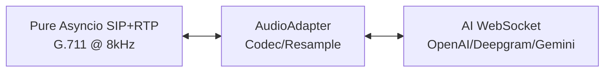
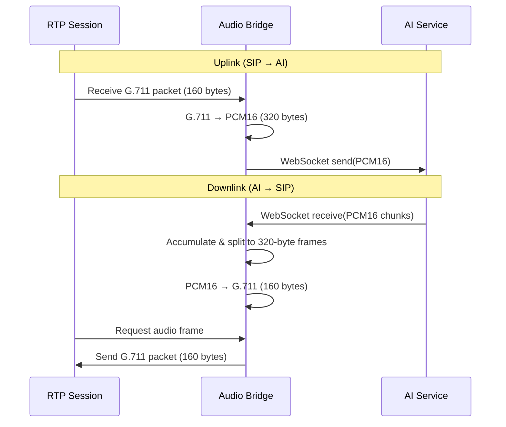

# SIP-to-AI

⭐ **Star to follow updates & roadmap**

**SIP-to-AI** — stream RTP audio from **FreeSWITCH / OpenSIPS / Asterisk** directly to **end-to-end realtime voice models**:
- ✅ **OpenAI Realtime API** (gpt-realtime GA)
- ✅ **Deepgram Voice Agent**
- ✅ **Gemini Live** (Gemini 2.5 Flash)

Simple passthrough bridge: **SIP (G.711 μ-law @ 8kHz)** ↔ **AI voice models**. OpenAI and Deepgram support native G.711, Gemini requires PCM16 resampling (8kHz ↔ 16kHz/24kHz).

## Quick Start (OpenAI Realtime)

**Prerequisites:** Python 3.12+, UV package manager

**Pure Python, No External Dependencies:** This project uses a pure Python asyncio implementation of SIP+RTP. No C libraries or compilation required!

1. **Install dependencies:**
   ```bash
   git clone <repository-url>
   cd sip-to-ai
   uv venv && source .venv/bin/activate
   uv sync
   ```

2. **Configure environment:**
   ```bash
   cp .env.example .env
   ```

   Edit `.env` with your OpenAI API key:
   ```bash
   # AI Service
   AI_VENDOR=openai
   OPENAI_API_KEY=sk-proj-your-key-here
   OPENAI_MODEL=gpt-realtime

   # Agent prompt
   AGENT_PROMPT_FILE=agent_prompt.yaml

   # SIP Settings (userless account - receive only)
   SIP_DOMAIN=192.168.1.100
   SIP_TRANSPORT_TYPE=udp
   SIP_PORT=6060
   ```

   **Optional:** Create `agent_prompt.yaml` for custom agent personality:
   ```yaml
   instructions: |
     You are a helpful AI assistant. Be concise and friendly.

   greeting: "Hello! How can I help you today?"
   ```

3. **Run the server:**
   ```bash
   uv run python -m app.main
   ```

   The server will listen on `SIP_DOMAIN:SIP_PORT` for incoming calls. Each call creates an independent OpenAI Realtime WebSocket connection.

4. **Make a test call:**
   ```bash
   # From FreeSWITCH/Asterisk, dial to bridge IP:port
   # Or use a SIP softphone to call sip:192.168.1.100:6060
   ```

## Project Overview

### Core Architecture



**Design Philosophy**: Minimal client logic. The bridge is a transparent audio pipe:
- **Pure Python asyncio**: No GIL issues, no C dependencies
- **Codec conversion only**: PCM16 ↔ G.711 μ-law (OpenAI/Deepgram: same 8kHz, no resampling; Gemini: 8kHz ↔ 16kHz/24kHz resampling)
- **Precise 20ms timing**: Using `asyncio.sleep()` with drift correction
- **Structured concurrency**: All tasks managed with `asyncio.TaskGroup`
- **No client-side VAD/barge-in**: AI models handle all voice activity detection
- **No jitter buffer**: AI services provide pre-buffered audio
- **Connection management**: WebSocket lifecycle and reconnection

### Audio Flow



**Key Points:**
- **20ms frames**: 320 bytes PCM16 (8kHz) or 160 bytes G.711 μ-law
- **Asyncio-based**: RTP protocol → asyncio.Queue → async AI WebSocket
- **Variable AI chunks**: Accumulated in buffer, split into fixed 320-byte frames
- **No padding during streaming**: Incomplete frames kept until next chunk arrives

### Components

#### SIP+RTP Stack (`app/sip_async/`)

**`AsyncSIPServer`** (`app/sip_async/async_sip_server.py`)
- Pure asyncio SIP server listening for INVITE requests
- UDP datagram protocol for SIP signaling
- Creates AsyncCall instances for each incoming call
- Handles SIP messages: INVITE, ACK, BYE with proper RFC 3261 responses

**`RTPSession`** (`app/sip_async/rtp_session.py`)
- Pure asyncio RTP protocol implementation
- G.711 μ-law codec (PCMU) support
- Precise 20ms frame timing with drift correction
- Bidirectional audio streaming over UDP

**`RTPAudioBridge`** (`app/sip_async/audio_bridge.py`)
- Bridges RTP session with AudioAdapter
- Handles G.711 ↔ PCM16 codec conversion
- Uses asyncio.TaskGroup for structured concurrency

#### Bridge Layer (`app/bridge/`)

**`AudioAdapter`** (`app/bridge/audio_adapter.py`)
- Audio format adapter for SIP ↔ AI streaming
- PCM16 passthrough with optional codec conversion
- Accumulation buffer for variable-size AI chunks → fixed 320-byte frames
- Thread-safe buffers: `asyncio.Queue` for uplink and downlink

**`CallSession`** (`app/bridge/call_session.py`)
- Manages AI connection lifecycle for a single call
- Three async tasks per call:
  1. **Uplink**: Read from AudioAdapter → send to AI
  2. **AI Receive**: Receive AI chunks → feed to AudioAdapter
  3. **Health**: Ping AI connection, reconnect on failure
- Uses `asyncio.TaskGroup` for structured concurrency

#### AI Clients (`app/ai/`)

**`OpenAIRealtimeClient`** (`app/ai/openai_realtime.py`)
- WebSocket: `wss://api.openai.com/v1/realtime`
- Audio format: `audio/pcmu` (G.711 μ-law @ 8kHz)
- Supports session config: instructions, voice, temperature
- Optional greeting message on connect

**`DeepgramAgentClient`** (`app/ai/deepgram_agent.py`)
- WebSocket: `wss://agent.deepgram.com/agent`
- Audio format: mulaw (same as G.711 μ-law @ 8kHz)
- Settings: listen model, speak model, LLM model, agent prompt

**`GeminiLiveClient`** (`app/ai/gemini_live.py`)
- WebSocket: `wss://generativelanguage.googleapis.com/ws/...BidiGenerateContent`
- Audio format: PCM16 (input @ 16kHz, output @ 24kHz)
- Resampling: 8kHz SIP ↔ 16kHz/24kHz Gemini (handled internally)
- Settings: model, voice, system instructions


## Deepgram Voice Agent Setup

Set `AI_VENDOR=deepgram` in `.env`:

```bash
AI_VENDOR=deepgram
DEEPGRAM_API_KEY=your-key-here
AGENT_PROMPT_FILE=agent_prompt.yaml  
DEEPGRAM_LISTEN_MODEL=nova-2
DEEPGRAM_SPEAK_MODEL=aura-asteria-en
DEEPGRAM_LLM_MODEL=gpt-4o-mini
```

Create `agent_prompt.yaml` (required):
```yaml
instructions: |
  You are a helpful AI assistant. Be concise and friendly.

greeting: "Hello! How can I help you today?"
```

Get your API key from [Deepgram Console](https://console.deepgram.com).


## Gemini Live Setup

Set `AI_VENDOR=gemini` in `.env`:

```bash
AI_VENDOR=gemini
GEMINI_API_KEY=your-key-here
AGENT_PROMPT_FILE=agent_prompt.yaml
GEMINI_MODEL=gemini-2.5-flash-native-audio-preview-12-2025
GEMINI_VOICE=Puck
```

Available voices: `Puck`, `Charon`, `Kore`, `Fenrir`, `Aoede`

Get your API key from [Google AI Studio](https://aistudio.google.com/apikey).

**Note:** Gemini Live uses PCM16 audio (16kHz input, 24kHz output), so the bridge performs resampling from/to 8kHz SIP audio. This adds minimal latency (<5ms).


## Performance

**Latency:**
- SIP → AI: <10ms (codec only)
- AI → SIP: <10ms (codec only)
- Total: ~100-300ms (AI processing dominates)
- 
**Why Fast?**
- OpenAI/Deepgram: No resampling (8kHz throughout)
- Gemini: Minimal resampling overhead (<5ms)
- No client-side VAD/barge-in
- No jitter buffer
- Just codec conversion

## Troubleshooting

**Choppy Audio:** Check network to AI service. AI handles jitter buffering.

**High Latency:** Verify AI service response times. Client-side is <10ms.

**SIP Connection Failed:**
- Check firewall/NAT for incoming SIP INVITE on UDP port
- Verify `SIP_DOMAIN` and `SIP_PORT` in `.env`
- Check logs for SIP protocol errors

**AI Disconnection:**
- Validate API keys
- Check service quotas and rate limits
- Monitor logs for reconnection attempts


## License

Apache License 2.0

This project is licensed under the Apache License 2.0 - see the [LICENSE](LICENSE) file for details.

Pure Python implementation with no GPL dependencies.