# SIP-to-AI

⭐ **Star to follow updates & roadmap**

**SIP-to-AI** — stream RTP audio from **FreeSWITCH / OpenSIPS / Asterisk** directly to **end-to-end realtime voice models**:
- ✅ **OpenAI Realtime API** (gpt-realtime GA)
- ✅ **Deepgram Voice Agent**
- 🔜 **Gemini Live** (coming soon)

Simple passthrough bridge: **SIP (G.711 μ-law @ 8kHz)** ↔ **AI voice models** with native codec support, no resampling needed.

## Quick Start (OpenAI Realtime)

**Prerequisites:** Python 3.12+, UV package manager

1. **Install PJSUA2** (from local build):
   ```bash
   cd ~/pjproject/pjsip-apps/src/swig/python
   uv pip install .

   # Verify
   python -c "import pjsua2 as pj; ep = pj.Endpoint(); ep.libCreate(); print('PJSUA2:', ep.libVersion().full); ep.libDestroy()"
   ```

   See [PJSIP Building Documentation](https://docs.pjsip.org/en/latest/pjsua2/building.html) for details.


2. **Install dependencies:**
   ```bash
   git clone <repository-url>
   cd sip-to-ai
   uv venv && source .venv/bin/activate
   uv sync
   ```

3. **Configure environment:**
   ```bash
   cp .env.example .env
   ```

   Edit `.env` with your OpenAI API key:
   ```bash
   # AI Service
   AI_VENDOR=openai
   OPENAI_API_KEY=sk-proj-your-key-here
   OPENAI_MODEL=gpt-realtime

   # Agent prompt
   AGENT_PROMPT_FILE=agent_prompt.yaml

   # SIP Settings (userless account - receive only)
   SIP_DOMAIN=192.168.1.100
   SIP_TRANSPORT_TYPE=udp
   SIP_PORT=6060
   ```

   **Optional:** Create `agent_prompt.yaml` for custom agent personality:
   ```yaml
   instructions: |
     You are a helpful AI assistant. Be concise and friendly.

   greeting: "Hello! How can I help you today?"
   ```

4. **Run the server:**
   ```bash
   uv run python -m app.main
   ```

   The server will listen on `SIP_DOMAIN:SIP_PORT` for incoming calls. Each call creates an independent OpenAI Realtime WebSocket connection.

5. **Make a test call:**
   ```bash
   # From FreeSWITCH/Asterisk, dial to bridge IP:port
   # Or use a SIP softphone to call sip:192.168.1.100:6060
   ```

## Project Overview

### Core Architecture

```mermaid
graph LR
    SIP[SIP/PJSUA2<br/>PCM16 @ 8kHz] <--> AA[AudioAdapter<br/>Codec Only]
    AA <--> AI[AI WebSocket<br/>G.711 μ-law @ 8kHz]
    
```



**Design Philosophy**: Minimal client logic. The bridge is a transparent audio pipe:
- **Codec conversion only**: PCM16 ↔ G.711 μ-law (same 8kHz, no resampling)
- **No client-side VAD/barge-in**: AI models handle all voice activity detection
- **No jitter buffer**: AI services provide pre-buffered audio
- **Connection management**: WebSocket lifecycle and reconnection

### Audio Flow

```mermaid
sequenceDiagram
    participant PJSUA2
    participant AudioAdapter
    participant AI as OpenAI/Deepgram

    Note over PJSUA2,AI: Uplink (SIP → AI)
    PJSUA2->>AudioAdapter: onFrameReceived(PCM16, 320 bytes)
    AudioAdapter->>AudioAdapter: PCM16 → G.711 μ-law (160 bytes)
    AudioAdapter->>AI: WebSocket send(G.711)

    Note over PJSUA2,AI: Downlink (AI → SIP)
    AI->>AudioAdapter: WebSocket receive(G.711 chunks)
    AudioAdapter->>AudioAdapter: Accumulate & split to 320-byte frames
    AudioAdapter->>AudioAdapter: G.711 → PCM16
    PJSUA2->>AudioAdapter: onFrameRequested()
    AudioAdapter->>PJSUA2: return PCM16 (320 bytes)
```



**Key Points:**
- **20ms frames**: 320 bytes PCM16 (8kHz) or 160 bytes G.711 μ-law
- **Thread-safe**: PJSUA2 callbacks → asyncio.Queue → async AI WebSocket
- **Variable AI chunks**: Accumulated in buffer, split into fixed 320-byte frames
- **No padding during streaming**: Incomplete frames kept until next chunk arrives

### Components

**`AudioAdapter`** (`app/sip/audio_adapter.py`)
- Codec conversion: PCM16 ↔ G.711 μ-law
- Accumulation buffer for variable-size AI chunks → fixed 320-byte frames
- Thread-safe buffers: `asyncio.Queue` for uplink (SIP→AI) and downlink (AI→SIP)

**`CallSession`** (`app/sip/audio_adapter.py`)
- Manages three async tasks per call:
  1. **Uplink**: Read from uplink stream → send to AI
  2. **AI Receive**: Receive AI chunks → feed to downlink stream
  3. **Health**: Ping AI connection, reconnect on failure
- Uses `asyncio.TaskGroup` for structured concurrency

**`OpenAIRealtimeClient`** (`app/ai/openai_realtime.py`)
- WebSocket: `wss://api.openai.com/v1/realtime`
- Audio format: `audio/pcmu` (G.711 μ-law @ 8kHz)
- Supports session config: instructions, voice, temperature
- Optional greeting message on connect

**`DeepgramAgentClient`** (`app/ai/deepgram_agent.py`)
- WebSocket: `wss://agent.deepgram.com/agent`
- Audio format: mulaw (same as G.711 μ-law @ 8kHz)
- Settings: listen model, speak model, LLM model, agent prompt

**`PJSIPMediaPort`** (`app/sip/pjsua2_endpoint.py`)
- PJSUA2 callbacks: `onFrameReceived()`, `onFrameRequested()`
- Bridges sync callbacks to async `AudioAdapter`


## Deepgram Voice Agent Setup

Set `AI_VENDOR=deepgram` in `.env`:

```bash
AI_VENDOR=deepgram
DEEPGRAM_API_KEY=your-key-here
AGENT_PROMPT_FILE=agent_prompt.yaml  
DEEPGRAM_LISTEN_MODEL=nova-2
DEEPGRAM_SPEAK_MODEL=aura-asteria-en
DEEPGRAM_LLM_MODEL=gpt-4o-mini
```

Create `agent_prompt.yaml` (required):
```yaml
instructions: |
  You are a helpful AI assistant. Be concise and friendly.

greeting: "Hello! How can I help you today?"
```

Get your API key from [Deepgram Console](https://console.deepgram.com).


## Performance

**Latency:**
- SIP → AI: <10ms (codec only)
- AI → SIP: <10ms (codec only)
- Total: ~100-300ms (AI processing dominates)
- 
**Why Fast?**
- No resampling (8kHz throughout)
- No client-side VAD/barge-in
- No jitter buffer
- Just codec conversion

## Troubleshooting

**Choppy Audio:** Check network to AI service. AI handles jitter buffering.

**High Latency:** Verify AI service response times. Client-side is <10ms.

**SIP Connection Failed:**
- Check firewall/NAT for incoming SIP INVITE
- Verify `SIP_DOMAIN` and `SIP_PORT` in `.env`
- Confirm PJSUA2 installed: `python -c "import pjsua2"`

**AI Disconnection:**
- Validate API keys
- Check service quotas and rate limits
- Monitor logs for reconnection attempts


## License

GNU General Public License v2.0 (GPL-2.0)

This project uses PJSUA2, which is licensed under GPL v2. Therefore, this project is also distributed under GPL v2 to comply with PJSUA2's licensing requirements.